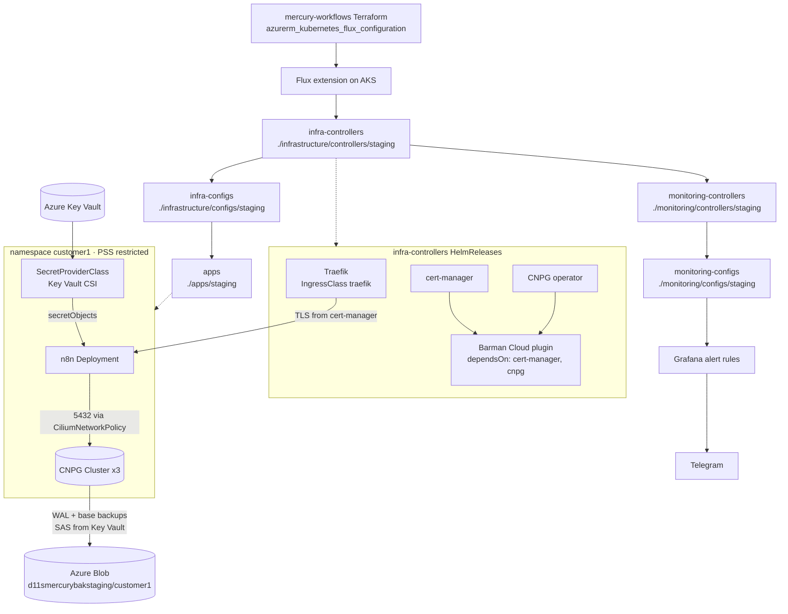

# mercury-gitops

The Flux GitOps repo for my "Mercury" AKS cluster. It runs n8n for each tenant on CloudNativePG, backs it up to Azure Blob, takes secrets from Key Vault, and sends alerts from Grafana to Telegram.

> **Built on KubeCraft.** The layout and most manifests come from **KubeCraft's _DevOps OS Part 2 / Kubernetes in the Cloud_** course by **[Mischa van den Burg](https://github.com/mischavandenburg)**. I adapted it for my own cluster and domain and have kept iterating on it since. My changes are listed in [What I added / adapted](#what-i-added--adapted).

[](https://github.com/dkelertas-homelab/mercury-gitops/actions/workflows/validate.yml)
[](https://github.com/dkelertas-homelab/mercury-gitops/actions/workflows/deploy-dev.yml)
[](https://github.com/dkelertas-homelab/mercury-gitops/actions/workflows/deploy-prod.yml)

## What this is

The Terraform in **[mercury-workflows](https://github.com/dkelertas-homelab/mercury-workflows)** (private repo) creates the AKS cluster (Australia East) and installs the AKS **Flux extension**. Flux pulls this repo over an SSH deploy key (branch `master`) and reconciles:

- **Infrastructure controllers**: Traefik (`37.4.0`), cert-manager (`v1.19.1`), the CloudNativePG operator (`0.26.1`) and the Barman Cloud plugin (`0.3.1`)
- **Infrastructure configs**: Let's Encrypt staging and prod `ClusterIssuer`s (HTTP-01 through Traefik)
- **Apps**: one namespace per customer (`customer1` today). Each gets n8n `2.35.3`, a 3-instance CNPG cluster, a Barman `ObjectStore` on Azure Blob, a daily `ScheduledBackup`, an Ingress with TLS, and a `CiliumNetworkPolicy`
- **Monitoring**: kube-prometheus-stack (Prometheus with 7-day retention, Grafana) plus Grafana-native alert rules sent to Telegram (Alertmanager is disabled)

Live hostnames are `*.mercury-staging.d11s.space`.

## Architecture



The Kustomization chain and its `dependsOn` order are declared in Terraform (see `mercury-tf/main.tf` in mercury-workflows). Ordering *inside* `infra-controllers` uses HelmRelease `dependsOn`.

## Repo layout

| Path | What's in it |
|------|--------------|
| `infrastructure/controllers/base/` | HelmRepository + HelmRelease for `traefik`, `cert-manager`, `cnpg`. |
| `infrastructure/controllers/staging/` | Staging overlay; adds `cnpg/plugin-release.yaml` (Barman Cloud plugin with `dependsOn` and retries). |
| `infrastructure/configs/` | Let's Encrypt `ClusterIssuer`s (staging + prod). |
| `apps/base/customer1/` | Namespace (PSS `restricted`), SecretProviderClass, CNPG `Cluster`, `ObjectStore`, `ScheduledBackup`, n8n Deployment/Service/PVC/Ingress, `CiliumNetworkPolicy`. |
| `apps/staging/` | Overlay that patches in the Key Vault identity and tenant, backup destination URL, and `d11s.space` hostnames. |
| `monitoring/controllers/` | kube-prometheus-stack HelmRelease (staging pins `80.2.0`; the base is staged at `91.3.0` for a later upgrade), values via `configMapGenerator`, Grafana SecretProviderClass. |
| `monitoring/configs/staging/grafana/alerting/` | Contact point, notification policy and alert rules: CNPG operator/plugin, backups, WAL archiving, replication lag, long transactions, n8n down, node/pod health. |
| `.github/` | GitHub Actions: `Validate` (PRs), `Deploy dev` / `Deploy prod`, reusable `Verify`, and a `setup-tools` composite action. |
| `scripts/` | The CI logic, runnable locally: `validate.sh`, `render.sh`, `health-check.sh`, `flux-reconcile.sh`, `list-overlays.sh`. |
| `docs/ci-cd-walkthrough.md` | My ADO → GitHub Actions notes for this repo, plus the remaining one-time setup. |
| `docs/sketches/secrets-bootstrap/` | Design notes and **not-applied** sketch YAMLs for fixing secret bootstrap order (ESO vs sync Job). |

## What I added / adapted

All of this is visible in `git log`:

- **Localised**: Key Vault `d11s-kv-mercury-staging`, storage `d11smercurybakstaging`, hostnames `customer1.` / `grafana.mercury-staging.d11s.space`, my own ACME email, and the AKS CSI identity and tenant patched into the staging overlay.
- **n8n upgrade**: `1.123.3` to `2.35.3`.
- **CNPG backup and restore drill** (Sept 2026): set a backup baseline, moved to the Barman Cloud **plugin** method, deleted the database cluster, **recovered it from Azure Blob** into a new cluster (`customer1-db2`), and repointed n8n at the restored endpoint. The `bootstrap.recovery` / `externalClusters` block is still in `database.yaml`, commented out, as a template.
- **Fresh-cluster race fix**: the Barman plugin HelmRelease now has `dependsOn: [cert-manager, cnpg]` plus install/upgrade remediation retries (PR #2).
- **Ingress class fix**: Traefik's chart default IngressClass is `traefik-traefik`. I override it to `traefik` and use that everywhere (PR #3).
- **Secrets-bootstrap analysis**: wrote up why the Key Vault CSI `secretObjects` approach deadlocks with CNPG `initdb`, and sketched two fixes: **External Secrets Operator** (preferred long-term) or a one-shot **sync Job**. See `docs/sketches/secrets-bootstrap/README.md`.
- **Workload hardening**: namespace PSS `restricted`, non-root UID 1000, `seccompProfile: RuntimeDefault`, read-only root FS with `emptyDir` for `/tmp` and cache, `drop: [ALL]`, requests/limits, liveness/readiness on `/healthz`.
- **Cilium policy**: n8n accepts traffic only from the `traefik` namespace on 3008. Egress is limited to its CNPG cluster on 5432, kube-dns on 53/UDP and the internet on 443.
- **Alerting**: Grafana alert rules sent to my own Telegram chat. The bot token comes from Key Vault, never from Git.

## CI/CD

GitHub Actions validates every change before Flux sees it, then checks the cluster afterwards. Full notes, including the Azure DevOps → GitHub mapping and the remaining setup: **[docs/ci-cd-walkthrough.md](docs/ci-cd-walkthrough.md)**.

- **Validate** (every PR into `dev`/`master`): yamllint, shellcheck, gitleaks over full history, `kustomize build` + kubeconform (with Flux/CNPG/cert-manager/Cilium CRD schemas) for every overlay, and rendered manifests per environment published as a build artifact.
- **Environments:** `dev` = the `*/staging` overlays on `mercury-staging`. `prod` = the `*/production` overlays on `mercury-production` (not built yet). Branches `dev` → `master` are the promotion path, and `prod` gets an approval gate.
- **Deploy = merge.** Flux pulls. The deploy workflows only trigger a Flux reconcile and then run `scripts/health-check.sh`: Flux and HelmReleases Ready, Deployments Available, CNPG healthy, HTTPS + TLS on the live hostnames. They log in with Azure OIDC (no secrets) and skip cleanly while the clusters are stopped.

```bash
yamllint . && scripts/validate.sh      # same checks as CI, locally
scripts/health-check.sh                # against the current kubectl context
```

## Bootstrap

You don't apply this repo by hand. Flux is installed and configured by Terraform:

```bash
# in mercury-workflows
cd mercury-tf
terraform init -backend-config=azure-blob.tfbackend
terraform apply

# then
az aks get-credentials -g rg-cloud-course-aks -n mercury-staging
kubelogin convert-kubeconfig -l azurecli   # Entra ID-enabled cluster
flux get kustomizations -A       # infra-controllers → infra-configs → apps, monitoring-*
flux get helmreleases -A
kubectl cnpg status customer1-db -n customer1
```

After **recreating the cluster**, update the Key Vault CSI identity in `apps/staging/customer1/kustomization.yaml` and `monitoring/controllers/staging/kube-prometheus-stack/kustomization.yaml` with `terraform output aks_keyvault_secrets_provider_client_id`. Then point DNS at the new Traefik LoadBalancer IP.

## Lessons / gotchas

- **Secrets chicken-and-egg.** Key Vault CSI only writes Kubernetes Secrets when a pod mounts the volume. CNPG needs `customer1-db-credentials` before `initdb`, but the only mounter is n8n, which needs the database. Fix options are in `docs/sketches/secrets-bootstrap/`.
- **A stale CSI identity means `Identity not found`.** Every new AKS cluster gets a new Secrets Provider identity, and the overlay patch must follow it.
- **Controllers need ordering too.** On a fresh cluster the Barman plugin chart raced cert-manager's webhook and CRDs. HelmRelease `dependsOn` plus retries solved it.
- **Chart defaults can surprise you.** Traefik's IngressClass name, `traefik-traefik`, broke Ingress matching until I overrode it.
- **Restores go to a new cluster name.** CNPG recovers into a new `Cluster`, so app config (DB host) has to move with it. Plan the cut-over.
- **Flux fixes manual changes.** Suspend Kustomizations before chaos-testing alerts (e.g. scaling n8n to 0), or Flux undoes the test.

## Security note

No credentials live in this repo. DB passwords, the blob SAS token, the Grafana admin password and the Telegram bot token are all in Azure Key Vault, delivered by the CSI driver. Tenant, managed-identity and Telegram chat IDs appear in overlays; they're identifiers, not secrets. The sketch YAMLs in `docs/` aren't referenced by any `kustomization.yaml`. gitleaks scans the full history on every PR.

## Related

- **[mercury-workflows](https://github.com/dkelertas-homelab/mercury-workflows)** (private): the Terraform that builds the AKS cluster and wires Flux to this repo.
- **[d11s.space](https://d11s.space)**: my blog, with homelab and platform write-ups.
- **KubeCraft** course by Mischa van den Burg: the foundation this is built on.
