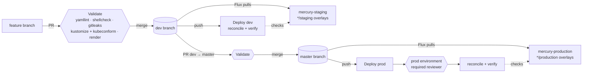

# CI/CD walkthrough: Azure DevOps → GitHub Actions

These are notes I made while setting up GitHub Actions on this repo. I've written Azure DevOps (ADO) pipelines for years, so I wrote each piece down as "in ADO I'd…, in GitHub it's…".

## What's in `.github/`

| File | What it does |
|---|---|
| `workflows/validate.yml` | PR validation (into `dev` and `master`, plus pushes to them): yamllint, shellcheck, gitleaks, `kustomize build` + kubeconform for every overlay (matrix), renders per-env manifests as an artifact, and a single `validate` result job for branch protection |
| `workflows/verify.yml` | Reusable (`workflow_call`) + manual. Azure OIDC login → AKS creds → optional Flux reconcile → `scripts/health-check.sh` |
| `workflows/deploy-dev.yml` | Push to `dev` → environment `dev` → reconcile + verify `mercury-staging` |
| `workflows/deploy-prod.yml` | Push to `master` → environment `prod` (approval) → reconcile + verify `mercury-production` |
| `actions/setup-tools/` | Composite action that installs pinned kustomize/kubeconform/gitleaks with checksum checks |

All the logic is in `scripts/`, so I can run the same thing locally:

```bash
yamllint .                    # lint
scripts/validate.sh           # kustomize build + kubeconform, all overlays
scripts/render.sh dev         # what CI publishes as the "build artifact"
scripts/health-check.sh       # against my current kubectl context
```

## ADO → GitHub mapping

| Azure DevOps | GitHub Actions | Here |
|---|---|---|
| `azure-pipelines.yml` (Pipelines YAML) | `.github/workflows/*.yml` | one file per pipeline: validate, deploy-dev, deploy-prod, verify |
| stages / jobs / steps, `dependsOn` | jobs / steps, `needs:` (no stages; a stage = a job or a separate workflow) | `discover → manifests → render → validate` |
| `strategy: matrix` + output variables | `strategy.matrix` + `fromJSON(needs.x.outputs.y)` | one leg per Flux overlay |
| templates (steps/jobs/stages) | composite actions (steps) / reusable workflows (jobs) | `setup-tools` / `verify.yml` |
| service connection (workload identity federation) | `azure/login` with an OIDC federated credential | no client secret anywhere |
| variable groups / Library, secret variables | repo / environment **variables** and **secrets** | only variables; nothing secret is needed |
| environments + approvals & checks | GitHub Environments + required reviewers + deployment branch rules | `dev`, `prod` |
| branch policies + build validation | branch protection / **rulesets** + required status checks | `master` + `dev` require the `validate` check and a PR |
| `PublishPipelineArtifact` | `actions/upload-artifact` | `rendered-<env>-<sha>` |
| agent pools / self-hosted agents | GitHub-hosted runners / self-hosted runners | `ubuntu-latest` |
| `trigger:` / `pr:` / manual run | `on: push` / `pull_request` / `workflow_dispatch` | |
| release pipelines (push to cluster) | **GitOps**: Flux pulls; deploy workflows promote + verify | see below |

### The big mental shift: in GitOps, the merge *is* the deploy

In ADO my release stage would `kubectl apply` or `helm upgrade` into the cluster. Here **Flux pulls** from Git. The cluster has no inbound credentials from CI, and nothing in a pipeline pushes to the cluster. So the pipeline stages become:

- **Build** = render the manifests and publish them as an artifact (a reviewable record of exactly what Flux will apply)
- **Deploy** = *promote* by merging `dev` → `master`. The workflow only asks Flux to reconcile now (`reconcile.fluxcd.io/requestedAt`, the same thing `flux reconcile` sets) so I don't wait out the 5-minute interval
- **Verify** = the part the pipeline actually owns: Flux Ready, HelmReleases Ready, Deployments Available, CNPG healthy, HTTPS + TLS on the real hostnames

## How a change flows



Day to day:

```bash
git switch -c feat/something dev           # work off dev
gh pr create --base dev                    # Validate runs; merge when green
gh pr create --base master --head dev      # promote; Deploy prod waits for my approval
gh workflow run verify.yml -f environment=dev -f reconcile=true   # ad-hoc health check
```

Clusters are normally **stopped** to save money. The deploy/verify jobs skip cleanly (green, with a notice) when the Azure variables aren't set, the cluster is stopped, or (prod only) there are no `*/production` overlays yet. After `az aks start …` I just re-run Verify.

## Things that tripped me up

- **The first run caught a real bug.** yamllint failed on an unclosed quote in `monitoring/controllers/base/kube-prometheus-stack/release.yaml` (fixed in #6). Flux never noticed because the staging overlay doesn't use that base. That's exactly why the pipeline lints *everything*, not just what's deployed.
- **Job-level `if:` can't see environment variables.** The environment is only applied once the job starts, so the "are the Azure vars set?" gate reads **repo-level** variables.
- **Approvals are per job.** Each job that targets `prod` asks for approval again. So reconcile + verify live in *one* reusable job: one approval per deploy.
- **Matrix check names change when overlays change.** Branch protection requires the single aggregate `validate` job (`if: always()` + check every `needs.*.result`), not each matrix leg.
- **Runner tool versions differ from mine.** The runner's shellcheck 0.9 uses SC2317 where my 0.11 uses SC2329. I pin what matters (kustomize, kubeconform, gitleaks, yamllint) and check checksums.
- **Reusable workflows need permissions passed down.** The caller has to grant `id-token: write` or OIDC login fails inside `verify.yml`.

## One-time setup I did

Done:

- [x] GitHub Environments `dev` (deploys from `dev`, `master`) and `prod` (deploys from `master` only)
- [x] Ruleset `protect-master-dev` on `master` and `dev`: PR required, `validate` check required, no force-push, no deletion
- [x] `dev` branch created from `master`

**TODO** (needs Azure access; nothing below has been run yet):

**1. App registration + OIDC federated credentials**, one per GitHub Environment. ADO equivalent: creating a workload-identity service connection.

```bash
REPO=dkelertas-homelab/mercury-gitops
APP_ID=$(az ad app create --display-name gh-mercury-gitops --query appId -o tsv)
SP_OID=$(az ad sp create --id "$APP_ID" --query id -o tsv)

for env in dev prod; do
  az ad app federated-credential create --id "$APP_ID" --parameters "{
    \"name\": \"gh-mercury-gitops-$env\",
    \"issuer\": \"https://token.actions.githubusercontent.com\",
    \"subject\": \"repo:$REPO:environment:$env\",
    \"audiences\": [\"api://AzureADTokenExchange\"]
  }"
done
```

**2. Azure RBAC on each cluster.** `Azure Kubernetes Service Cluster User Role` covers `az aks show` + `get-credentials`.

```bash
for c in "rg-cloud-course-aks mercury-staging" "rg-cloud-course-aks-prod mercury-production"; do
  set -- $c
  AKS_ID=$(az aks show -g "$1" -n "$2" --query id -o tsv) || continue   # prod doesn't exist yet
  az role assignment create --assignee-object-id "$SP_OID" --assignee-principal-type ServicePrincipal \
    --role "Azure Kubernetes Service Cluster User Role" --scope "$AKS_ID"
done
```

**3. Kubernetes RBAC.** The clusters use Entra ID auth with *Kubernetes* RBAC (not Azure RBAC for K8s), so the service principal needs a binding inside the cluster. Least privilege: read what the health check reads, and patch only Flux objects (for the reconcile annotation). No access to Secrets. Later this could move into `infrastructure/configs/<env>` so Flux owns it.

```bash
az aks get-credentials -g rg-cloud-course-aks -n mercury-staging && kubelogin convert-kubeconfig -l azurecli
kubectl apply -f - <<YAML
apiVersion: rbac.authorization.k8s.io/v1
kind: ClusterRole
metadata: { name: gh-actions-verify }
rules:
  - apiGroups: [""]
    resources: [namespaces, pods, services, events]
    verbs: [get, list, watch]
  - apiGroups: [apps]
    resources: [deployments, replicasets, statefulsets]
    verbs: [get, list, watch]
  - apiGroups: [networking.k8s.io]
    resources: [ingresses]
    verbs: [get, list, watch]
  - apiGroups: [postgresql.cnpg.io]
    resources: [clusters]
    verbs: [get, list, watch]
  - apiGroups: [helm.toolkit.fluxcd.io]
    resources: [helmreleases]
    verbs: [get, list, watch]
  - apiGroups: [source.toolkit.fluxcd.io, kustomize.toolkit.fluxcd.io]
    resources: [gitrepositories, helmrepositories, kustomizations]
    verbs: [get, list, watch, patch]
---
apiVersion: rbac.authorization.k8s.io/v1
kind: ClusterRoleBinding
metadata: { name: gh-actions-verify }
roleRef: { apiGroup: rbac.authorization.k8s.io, kind: ClusterRole, name: gh-actions-verify }
subjects:
  - { apiGroup: rbac.authorization.k8s.io, kind: User, name: "$SP_OID" }   # SP object ID
YAML
```

(The quick-and-dirty alternative is adding the SP to the cluster's Entra admin group, but that's cluster-admin for CI. No.)

**4. Repo variables.** These are *variables*, not secrets: OIDC means there's no credential to store.

```bash
gh variable set AZURE_CLIENT_ID       -R "$REPO" --body "$APP_ID"
gh variable set AZURE_TENANT_ID       -R "$REPO" --body "$(az account show --query tenantId -o tsv)"
gh variable set AZURE_SUBSCRIPTION_ID -R "$REPO" --body "$(az account show --query id -o tsv)"
# optional per-environment overrides (defaults are in verify.yml)
gh variable set AKS_CLUSTER_NAME   -R "$REPO" --env prod --body mercury-production
gh variable set AKS_RESOURCE_GROUP -R "$REPO" --env prod --body rg-cloud-course-aks-prod
```

**5. Required reviewer on `prod`** (= ADO environment *Approvals* check). Self-review stays allowed because it's just me.

```bash
gh api -X PUT "repos/$REPO/environments/prod" --input - <<'JSON'
{
  "reviewers": [{ "type": "User", "id": 283581275 }],
  "prevent_self_review": false,
  "deployment_branch_policy": { "protected_branches": false, "custom_branch_policies": true }
}
JSON
```

**6. Terraform: point each cluster's Flux at its branch** (in [`mercury-workflows/mercury-tf/main.tf`](https://github.com/dkelertas-homelab/mercury-workflows/blob/master/mercury-tf/main.tf)). Today `mercury-staging` tracks `master`. The dev/prod model needs:

```hcl
resource "azurerm_kubernetes_flux_configuration" "main" {   # mercury-staging = dev
  git_repository {
    reference_type  = "branch"
    reference_value = "dev"          # was "master"
    # ...
  }
}
# and for the future mercury-production cluster (= prod): a second flux configuration
# with reference_value = "master" and paths ./infrastructure/*/production,
# ./apps/production, ./monitoring/*/production
```

Until then, Deploy dev's "Flux pulled expected commit" check is just a warning, because staging is still on `master`.

**7. Production overlays.** Add `apps/production`, `infrastructure/{controllers,configs}/production` and `monitoring/{controllers,configs}/production`. Validate/render pick them up automatically (`scripts/list-overlays.sh`), and Deploy prod stops skipping.

**Later:** bump `azure/login@v2` → `@v3` (same inputs, Node 24 runtime).

## Links to brush up

GitHub Actions
- [Workflow syntax](https://docs.github.com/en/actions/reference/workflows-and-actions/workflow-syntax)
- [Variables](https://docs.github.com/en/actions/reference/workflows-and-actions/variables)
- [Reusing workflows](https://docs.github.com/en/actions/how-tos/reuse-automations/reuse-workflows)
- [Creating a composite action](https://docs.github.com/en/actions/tutorials/create-actions/create-a-composite-action)
- [Managing environments for deployment](https://docs.github.com/en/actions/how-tos/deploy/configure-and-manage-deployments/manage-environments)
- [Configuring OpenID Connect in Azure](https://docs.github.com/en/actions/how-tos/secure-your-work/security-harden-deployments/oidc-in-azure)
- [About rulesets](https://docs.github.com/en/repositories/configuring-branches-and-merges-in-your-repository/managing-rulesets/about-rulesets)
- [Migrating from Azure Pipelines to GitHub Actions](https://docs.github.com/en/actions/tutorials/migrate-to-github-actions/manual-migrations/migrate-from-azure-pipelines)
- [Migrating from Azure DevOps with GitHub Actions Importer](https://docs.github.com/en/actions/tutorials/migrate-to-github-actions/automated-migrations/azure-devops-migration)
- [azure/login](https://github.com/Azure/login) · [actions/upload-artifact](https://github.com/actions/upload-artifact)

Flux / Kubernetes tooling
- [Flux: Get started](https://fluxcd.io/flux/get-started/)
- [Flux: Kustomization API](https://fluxcd.io/flux/components/kustomize/kustomizations/)
- [`flux reconcile`](https://fluxcd.io/flux/cmd/flux_reconcile/)
- [kustomize reference](https://kubectl.docs.kubernetes.io/references/kustomize/)
- [kubeconform](https://github.com/yannh/kubeconform) · [CRDs-catalog](https://github.com/datreeio/CRDs-catalog)
- [gitleaks](https://github.com/gitleaks/gitleaks)
- [kubelogin](https://azure.github.io/kubelogin/)

Microsoft Learn
- [Build, test, and deploy to AKS with GitHub Actions](https://learn.microsoft.com/en-us/azure/aks/kubernetes-action)
- [Use GitHub Actions to connect to Azure (OIDC)](https://learn.microsoft.com/en-us/azure/developer/github/connect-from-azure-openid-connect)
- [GitOps with Flux v2 on AKS / Arc](https://learn.microsoft.com/en-us/azure/azure-arc/kubernetes/tutorial-use-gitops-flux2)
- [AKS Microsoft Entra ID integration](https://learn.microsoft.com/en-us/azure/aks/enable-authentication-microsoft-entra-id)
- [`az aks command invoke`](https://learn.microsoft.com/en-us/azure/aks/command-invoke) (the fallback if the API server ever goes private)
- [Azure Pipelines YAML schema](https://learn.microsoft.com/en-us/azure/devops/pipelines/yaml-schema/)
- [ADO environments](https://learn.microsoft.com/en-us/azure/devops/pipelines/process/environments) · [Approvals and checks](https://learn.microsoft.com/en-us/azure/devops/pipelines/process/approvals)
- [ADO: Connect to Azure with a service connection (workload identity federation)](https://learn.microsoft.com/en-us/azure/devops/pipelines/library/connect-to-azure)
- [Migrate CI/CD pipelines with GitHub Actions Importer (training)](https://learn.microsoft.com/en-us/training/modules/migrate-cicd-pipelines-to-github-with-github-actions-importer/)
